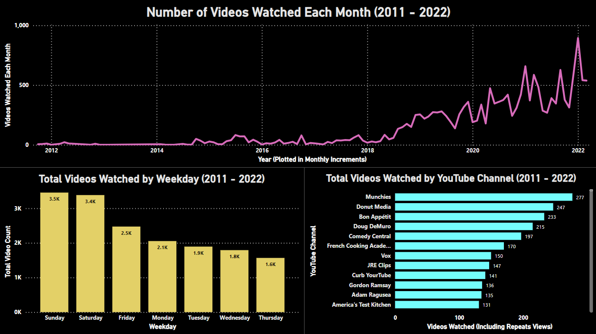

# Dan's YouTube Watch History
This is a mini-project showcasing work in SQL and Power BI.

A few things to note:
* The SQL code wwas largely written in 2022.
* The dashboard image shown below is the result of using Power BI on this dataset for only a few hours having never used it before.

## Background
Everyone's YouTube watch history is available from Google via a function called "Takeout" (as of March 2022), allowing the user to download the data in a JSON format.  The goal of this project was to build basic proficiency in SQL by collecting personal data and performing some level of manipulation in SQL.  These data have then been used to begin learning Power BI by building a simple dashboard in a few hours.

## Extracted Data
The following data were extracted from the fownloaded JSON file for initial analysis:
* Video Title
* Time (Assumed to be the time it was viewed)
* YouTube Channel for that video
* Video URL
* Channel URL
* Details (used for data cleaning)

## SQL
The SQL code can be found [here](SQL_Queries/SQLQuery2_YoutubeAll_Compact_Code_2.sql) and showcases the following skills:
* Importing and parsing JSON data into a SQL database in MS SQL Server
* Viewing the data in SQL to check for errors
* Data cleaning
    * Removing videos providd in the history that were actually ads
    * Removing videos that have since been taken down
    * Removing problem characters when exporting the data
* Date time formatting, and extracting date time features such as the weekday and hour
* Making new tables in a database
* Aggregate functions and grouping

# Power BI
A screenshot of the dashboard created is shown below in Power BI is provided below. Whiel the analysis is rudimentary, the purpose of this few-hour exercise was to gain some familiarity with the interface and basic capabilities.

